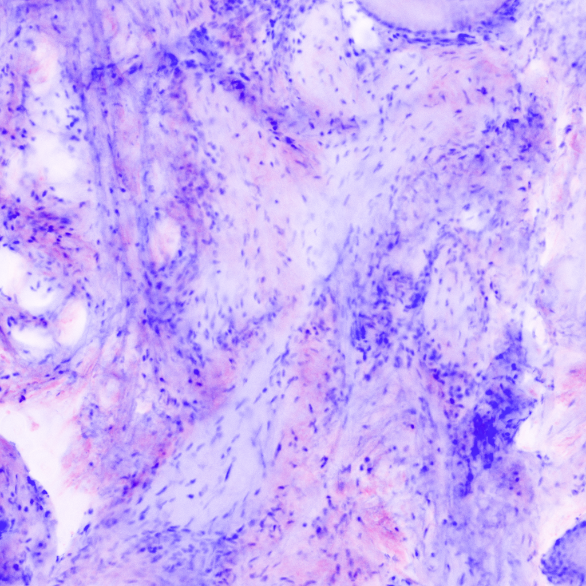
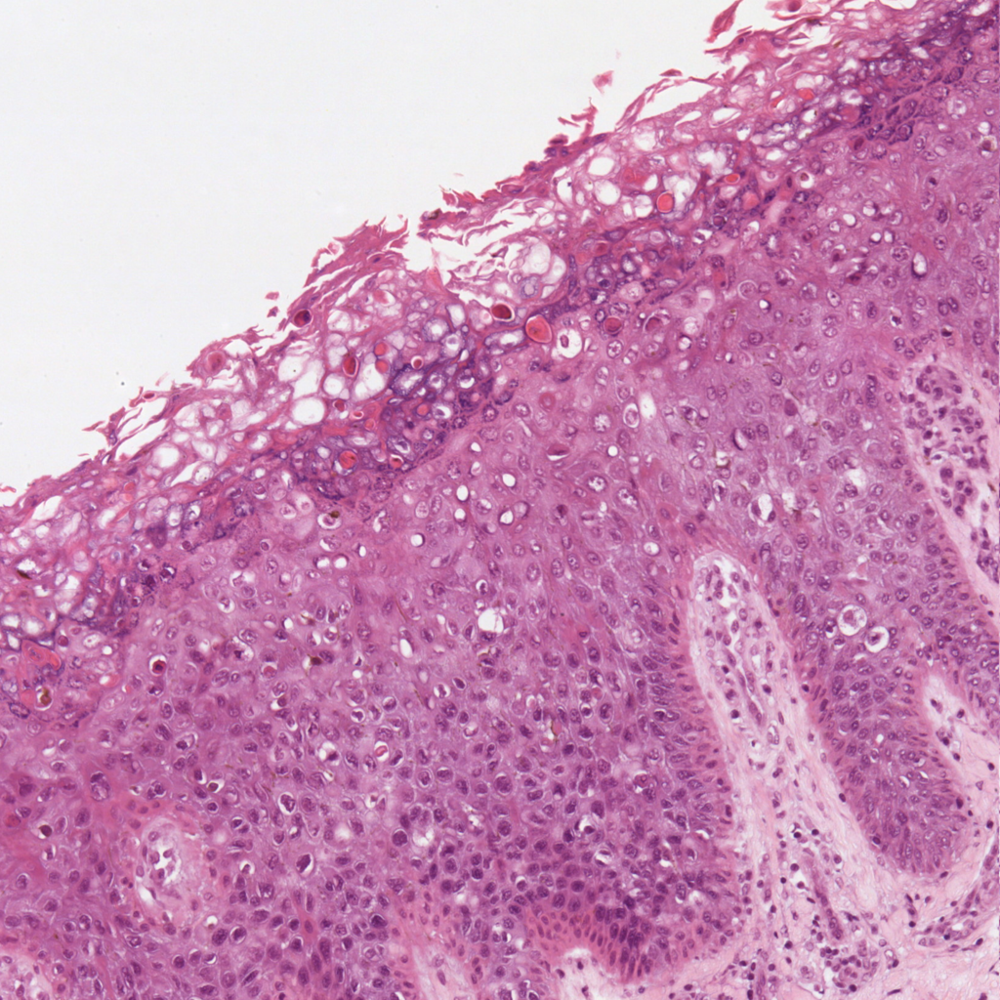

## Project background

In recent years,
dl
has significantly improved the performance of a wide range of computer
vision tasks like image classification, object detection or semantic
segmentation.
gans
in particular have revolutionized generative tasks like image synthesis
and image-to-image translation. Image-to-image translation is the task
of generating an image based on a given source image with different
characteristics depending on the specific problem.

In this work, based on  work in the Dermatology Department from the
Hospital Clínic de Barcelona, the idea of image-to-image translation is
applied to the transformation of
cm
histological images into
he
appearance.

### Confocal microscopy

cm
is an optical imaging technique for increasing optical resolution and
contrast of a micrograph by means of using a spatial pinhole to block
out-of-focus light in image formation. With it, technicians are able to
slice thin sections out of thick fluorescent specimens, view specimens
in planes tilted to the line of sight, penetrate deep into
light-scattering tissues, obtain 3D views at very high resolution... ()

Ex vivo\[1\] confocal scanning laser microscopy can potentially
accelerate Mohs surgery\[2\] by rapidly detecting carcinomas without
conventional frozen histopathology (and its consequential time delays)
().

Two different
cm
modes exist,
rcm
displays the backscattering signal of naturally occurring skin
components, whereas
fcm
provides contrast by using an applied fluorescent dye (). See figure
[2](#fig:CM-example) for an example.

\[fig:R-example\]

\[fig:F-example\]

## Problem statement

cm
has enabled rapid evaluation of tissue samples directly in the surgery
room significantly reducing the time of complex surgical operations in
skin cancer (), but the output largely differs from the standard
he
slides that pathologists typically use to analyze tissue samples. See
figure [3](#fig:HE-example) for a
he
example.

To bridge this gap, a method for combining the aforementioned modes of
cm
into a H\&E-like image is presented in this work. A correctly done CM to
H\&E mapping would bring the efficiency of
cm
to untrained pathologists and surgeons.

Similar to a false color (also known as pseudo color) transformation, a
parametric mapping function can be defined:
\[\label{eq:mapping-function}
    \tensor{DSCM}
    = f_{\theta}(\tensor{R}, \tensor{F})\] where
\(\tensor{DSCM} \in \R{}^{H \times W \times 3}\) (stands for
digitally-stained
cm)
represents the resulting H\&E-like RGB image,
\(\tensor{R}, \tensor{F} \in \R{}^{H \times W}\) represent the
reflectance and fluorescence modes (respectively) of the
cm
input image with height \(H\) and width \(W\).

### Affine transformation

An affine transfomation is proposed in  for the function \(f\) where the
RGB values for each pixel are computed as:
\[\label{eq:affine-transformation}
    \tensor{DSCM}_{x,y} = \tensor{1}
    - \text{F}_{x,y} (\tensor{1} - \tensor{H}) - \text{R}_{x,y} (\tensor{1} - \tensor{E})\]
where: \[\tensor{H} = \begin{bmatrix} 0.30 & 0.20 & 1 \end{bmatrix}\]
\[\tensor{E} = \begin{bmatrix} 1 & 0.55 & 0.88 \end{bmatrix}\] These
vectors represent coordinates in the RGB space (

-----

and

-----

). This way, the
cm
modes highlight different structures in distinct colours similar to a
he
slide; but as it can be seen in figure
[\[fig:affine-example\]](#fig:affine-example), the color scheme differs
from an actual
he
sample.

### Data-driven approach

In contrast to  work where the parameters (\(\tensor{H}\) and
\(\tensor{E}\)) are found experimentally, a data-driven approach of the
problem will be taken where the parameters of the mapping function
[\[eq:mapping-function\]](#eq:mapping-function) are *learned* based on
data. More specifically, the transformation will be defined by a
nn
(called *StainNN*) and the parameters will be searched through an
adversarial setting.

### Speckle noise reduction

rcm
images are affected by a multiplicative noise known as speckle, which
may impair the performance of post-processing techniques. Hence, before
digitally staining the
cm
images, this noise must be reduced.

The observed
rcm
image \(Y\) is related to the noise free image \(X\) by the following
multiplicative model: \[\label{eq:speckle-model}
    Y = X \odot F\] Where \(\odot\) denotes the Hadamard product (also
known as the elementwise product) and \(F\) is the speckle noise random
variable.

To reduce the speckle noise, a data-driven approach will also be taken
using the called *DespecklingNN*.

## Methods and procedures

This project was carried out at the Image and Video Processing Group
(GPI) research group from the Signal Theory and Communications
Department (TSC) at the Universitat Politecnica de Catalunya (UPC) in
collaboration with the Dermatology Department from the Hospital Clínic
de Barcelona.

The work presented in this thesis is the natural continuation of the
work presented in .

## Document structure

In section [\[sec:theoric-background\]](#sec:theoric-background) an
overview of relevant
dl
techniques and algorithms is presented to provide the reader a general
knowledge of the field.

Section [\[sec:methodology\]](#sec:methodology) contains the methodology
of the project with detailed explanations of the models used to solve
the presented problems. First the *DespeklingNN* is introduced in
[\[sec:despeckling-network\]](#sec:despeckling-network) then the
*StainNN* in [\[sec:stain-network\]](#sec:stain-network).

The experiments carried out to choose the right models are presented in
section [\[sec:experiments-and-results\]](#sec:experiments-and-results).

Finally, the conclusions and future work are discused in section
[\[sec:conclusions-and-future-development\]](#sec:conclusions-and-future-development).

1.  Ex vivo means that which takes place outside an organism. In
    science, ex vivo refers to experimentation or measurements done in
    or on tissue from an organism in an external environment with
    minimal alteration of natural conditions.

2.  Mohs micrographic surgery is considered the most effective technique
    for treating many basal cell carcinomas (BCCs) and squamous cell
    carcinomas (SCCs), the two most common types of skin cancer. The
    procedure is done in stages, including lab work, while the patient
    waits. This allows the removal of all cancerous cells for the
    highest cure rate while sparing healthy tissue and leaving the
    smallest possible scar.
