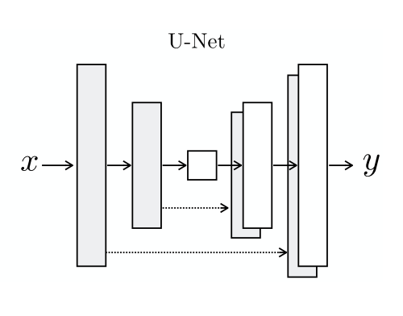
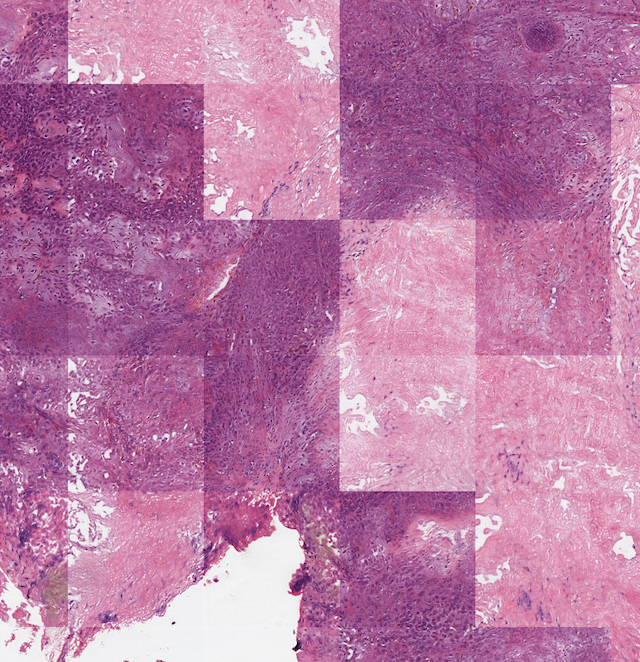
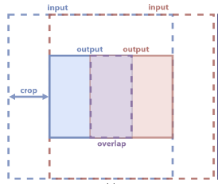
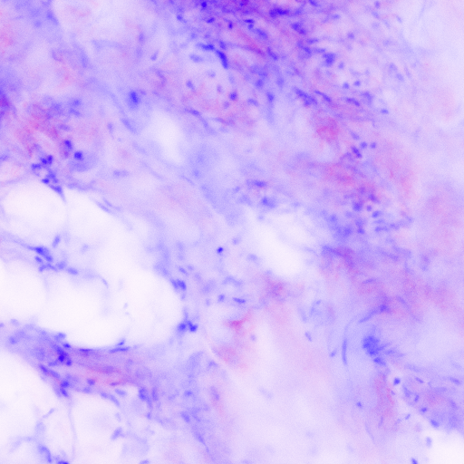
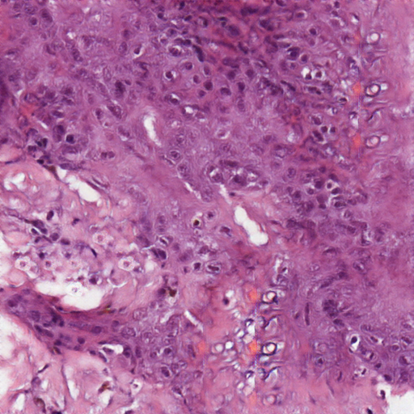

## Datasets

In this project two diferent datasets provided by the hospital clinic
have been used to train and validate the despeckle and stain models: one
for the
cm
domain and one for the
he
domain.

The Python implementation of all the datasets used can be found at
appendix [\[appendix:datasets\]](#appendix:datasets)

#### cm set

The
cm
dataset consists of 27 large slides (around 100,000,000 pixels), each
corresponing to a different sample of skin tissue. Some of this slides
contain artifacts around the edges; in order to not provide this noise
to the models, the slides are manually cropped avoiding this artifacts
and focusing on the area containing the tissue. Working with such a
large images is not practical since they do not fit in most GPUs’
memory. A simple script to extract overlaping 1024x1024 patches out of
the slides is developed so that, along with “on-the-fly” data
augmentation techniques (random crop and random flip), more information
can be extracted from the dataset. Only patches with a minimum mean grey
level on both modes are extracted to be sure that they contain tissue
texture. From that, a random sample of 1000 patches is used as a
training set.

#### he set

The
he
dataset contains a total of 560 crops of 1024x1024 pixels from whole
slide histopathological images.

## Despeckling network

As explained in section [\[sec:speckle-noise\]](#sec:speckle-noise),
rcm
contain artifacts caused by a multiplicative noise (see figure
[3](#fig:speckle) for an example). In this section different noise
models are described and then the proposed methods for mitigating it are
presented.

### Speckle noise

As a means of having pairs of noisy-clean images needed to train a
denoising model,
fcm
are artificially contaminated with a noise model. In SAR imaging, where
speckle noise also appears, the noise is modeled by a gamma distribution
with unit mean and variance \(\frac{1}{L}\) (assuming the image is an
average of \(L\) *looks*) (): \[\label{eq:gamma-distribution}
F \sim \Gamma(k = L, \theta = \frac{1}{L})\]

Other models for the noise distribution exist; for instance, MATLAB’s
Image Processing Toolbox uses a uniform distribution with mean 1 and
variance 0.05: \[F \sim U(0.6535,1.3464)\]

In the case of ultrasound imaging a rayleigh distribution with mean 1 is
used (): \[F \sim Rayleigh(\sigma=\sqrt{\frac{2}{\pi}})\]

Based on the appearence of artificially contaminated
fcm
images compared to naturally contaminated
rcm,
the experiments on this work are based on the gamma model
[\[eq:gamma-distribution\]](#eq:gamma-distribution).

### Proposed network architectures

In order to filter the speckle noise, several
dnn
with the same basic structure are defined. Inspired by the ResNet ()
they all share a *skip connection* between the first and last layer of a
cnn
similar to  approach for SAR imaging despeckling.

The code for the PyTorch implemetations of all the models can be found
at appendix [\[appendix:despeckling\]](#appendix:despeckling)

The
cnn
block consists of \(M\) convolutional layers each with \(K\) filters of
size \(N \times N\) and parametric
relu
activation functions (), except for the last layer which has one
\(1 \times 1\) filter to “merge” all the channels of the previous layer
into a single channel image. Versions with and without an activation
function are also defined.

The different model variations apply a distinct operation in the skip
connection:

1.  Division skip connection: A element-wise division between the input
    image and the network’s output is defined, so that it makes a
    prediction of the noise. A priori this model seems prone to suffer
    an unstable training.

2.  Multiplicative skip connection: A element-wise multiplication
    between the input image and the network’s output is defined, so that
    it makes a prediction of the inverse of the noise. Although this
    estimation is more complicated, it is a “safer” alternative to the
    previous one.

3.  Additive skip connection: A “classical” skip connection where matrix
    summation between the input and output of the network is performed.
    In this case, the operation is done in the log-space —the logarithm
    is applied to the input image and exponentiation to the model’s
    output— in order to turn the noise into an additive one so is
    possible for the model to remove it.

## Stain network

Obtaining aligned/paired data for
cm
to
he
is not possible since tissue blocks scanned with the CM need to undergo
slicing before staining with H\&E; hence, the staining models follow the
cyclegans
framework introduced in section
[\[sec:gans-translation\]](#sec:gans-translation).

The discriminator model used is the PatchGAN (), the motivation behind
this model is to model high-frequency “correctness”; this is done by
classifying (*real/fake*) small patches of the image (instead of the
whole image) and averaging all the responses to privide the definitive
output of the distriminator.

For the generator model a baseline is defined along with two families of
advanced models.

### Baseline

The baseline generator is a learned version of the affine transformation
defined in [\[eq:affine-transformation\]](#eq:affine-transformation). It
is implemented as a single convolutional layer with 3 filters of size 1
so each output pixel’s channel is a linear combination of the
rcm
and
fcm
values of the corresponding pixel of the source
cm
image plus a bias term.

### Advanced models

Both families follow an encoder-decoder structure, i.e.: a series of
convolution layers with down-sampling (encoder) followed by the same
number of layers with up-sampling (decoder), presumably the encoder maps
the input into a latent representation where semantic transformations
can be more easily defined and then the decoder “brings” it back to the
image space.

Instead of directly using the
cm
modes, the digital staining method proposed in  is used as source images
for the geneators. The reason is twofold: on the one hand to provide
more similar sets so that the mapping can be easier to learn, on the
other hand, applying the identity loss demands for domains with equal
number of channels.

1.  ResNet-like generator: This model has the folling structure:
    
      - First layer: The input image is first mirror padded to mantain
        its dimensions, it is then convolved with 64 \(7 \times 7\)
        filters, the output is normalized with an instance normalization
        layer () and followed by a
        relu
        activation function.
    
      - Down-sampling: This layer is composed by 3 2-strided (see
        down-sampling method [\[n-strided-conv\]](#n-strided-conv) in
        page ) convolution layers with exponentially increasing number
        of kernels of shape \(3 \times 3\) with instance normalization
        and
        relu
        after each layer. So after this block, the signal will have 512
        channels and the height and width will be reduced by a factor of
        8 (e.g., if the input image has size \(256 \times 256\), the
        output will be \(32 \times 32\)).
    
      - Residual blocks: In a residual block, intead of trying to learn
        a transformation \(\mathcal{T}(\tensor{x})\), the residual
        \(\mathcal{F}(\tensor{x})\) is learnt so that
        \(\mathcal{T}(\tensor{x}) = \mathcal{F}(\tensor{x}) + \tensor{x}\)
        (ilustrated in figure
        [\[fig:residual-block\]](#fig:residual-block)); the motivation
        behind this is to avoid the problem know as the degradation
        problem where deeper
        ann
        perform worse than shallower counterparts.  
        The generator network contains \(R\) two-layer residual blocks
        between the encoder and the decoder also with
        relu
        activation and instance normalization.
        
        The last two blocks are the “mirror image” of the first two,
        i.e.:
    
      - Up-sampling: 3 “up-convolution” layers with exponentialy
        decreasing number of filters so that the result is the same size
        as the original image.
    
      - Final layer: Finally, the result of the previous layer is
        convolved by 3 \(7 \times 7\) filters and a tanh activation
        function is used to bound the output’s range.

2.  UNet-like generator: The UNet () is a fully-convolutional network
    originally designed for medical image segmentation, it differs from
    standard encoder-decoder network in how the decoder reconstructs the
    image from the latent representation:
    
      - Encoder: The encoder follows the same structure as the first two
        layers of the above described ResNet. No residual blocks are
        defined between the encoder and the decoder.
    
      - Decoder: As a means to obtain low-level information (location,
        texture, ...) from the encoder, the output from the
        corresponding encoder layer is concatenated to the output of the
        previous decoder layer (figure
        [\[fig:unet-diagram\]](#fig:unet-diagram))

\[fig:residual-block\]

\[fig:unet-diagram\]

Both families use transposed convolutions in the decoder network.

## Inference technique

Whole slide images are too large to fit directly on a GPU, therefore,
the inference has to be tile-by-tile to obtain the stain transformed
result. This introduces artifacts (see figure
[\[fig:tiling-example\]](#fig:tiling-example)) between adjacent tiles in
the output due to instance normalization relying on tile statistics. In
order to fix this issue, the WSI inference technique from  is applied.

\[fig:tiling-example\]

\[fig:inference\]

So as to have neighbouring tiles with similar statistics, the method
feeds overlapping regions to the model. The steps are the following
(ilustrated in figure [\[fig:inference\]](#fig:inference)):

A large \(N \times N\) patch (e.g. \(2048 \times 2048\)) is transformed.

The borders are cropped to obtain the center of half the size of the
input: \(\frac{N}{2} \times \frac{N}{2} = M \times M\).

The next prediction is made for a patch a quarter of the size apart from
the previous one, i.e. the cropped output will have an overlap of 50%
with the previous one.

The crops are combined by multiplying (element-wise) by a weight matrix
and adding them. Two choices for this matrix are made:

An “all 0.25” matrix: \(\tensor{W} = 0.25 * \tensor{1}\)

The outer-product of two translated triangular functions of length
\(M\): \(\left[ \tensor{W} \right]_{m,n} =
\Lambda(\frac{m}{M / 2} -1)\Lambda(\frac{n}{M / 2} -1)\)
\[n-strided-conv\]

A version with non-overlapping outputs is also developed where only the
inputs overlap, instead of shifting the window by a quarter it is
shifted by the half of the input. In this case the number of iterations
to infer the whole slide is halved.

## Quantitative measurement

Evaluating generator models is not straightforward, as metrics for image
quality and diversity are dificult to define. Different methods are used
for comparing methods: The inception score (IS) () is used for measuring
the quality of generated samples, the Fréchet Inception Distance is
supposed to improve on the IS by comparing the statistics of generated
samples to real samples. In this work, a texture descriptor is used to
try to measure if the generated samples contain structures that are not
present in the source image (popularly known as hallucinations). An
example of an hallucination of a model during a failed training is shown
in figure [\[fig:hallucination\_B\]](#fig:hallucination_B).

The idea is to compare the input and output wholeslides by patches in a
texture sense. This is done by computing a texture descriptor of the
luminance of the source and the stained version and then computing a
distance of the two. After trying various posibilities, the chosen
texture descriptor is the
lbp
histogram ().

lbp
is a gray-level invariant feature extractor that assigns a number to
every set of 9 neighboring pixels —a central pixel and its 8 closest
pixels— in an image (in general, any number of pixels can be used but 9
is used here). The number is based on the difference of intensities
between the neighbors and the central pixel: a 1 is assigned on pixels
with a grey-level greater or equal than the center and 0 otherwise, this
creates a code for each pixel in the image —by reading the assigned
values clockwise starting at the top left corner as a binary word— that
encodes the different posible edges. An histogram of this codes can be
computed to obtain a description of the patterns that are found in a
given image or patch.

The distance between the result and source patches is measured using the
chi-squared distance between the normalized
lbp
histograms.

For reference purposes, the patch transformation depicted in figure
[\[fig:hallucination\]](#fig:hallucination) has a distance of 0.11.

\[fig:hallucination\_A\]

\[fig:hallucination\_B\]
