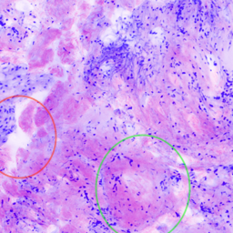
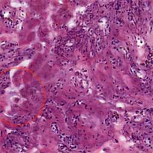

## GANs proof of concept

To test the adversarial setting versus a more traditional loss:
mse
(equation [\[eq:mse\]](#eq:mse)), a “toy example” is carried out: train
a generator model to fit a normal distribution with mean 0 and variance
1 (\(p_{data}\)).

The generator samples a vector of length 5 from a uniform ditribution
(range -0.5-0.5) (\(p_z\)) and passes it through 3 fully connected
layers\[1\] with LeakyReLU activation function and 5 units on each layer
except for the final layer which only has 1 unit (it outputs a scalar)
and no activation function (represented in figure
[2](#fig:gan-poc-generator)).

The target data comes from a sample of 100,000 i.i.d normal random
variables. The models are trained for 100 epochs with a batch size of
100 using the Adam optimization algorithm presented in section
[\[sec:optimizers\]](#sec:optimizers) with a learning rate of
\(5 \times 10^{-4}\) and default momentum values.

The results are compared by computing the Kolmogorov-Smirnov test of
normality\[2\].

### Results for mse loss

As to be expected, the
ann
simply ignores the source of randomness (set first layer’s weights close
to zero) and produces an almost deterministic output close to the
distribution’s expected value: this is in fact the optimal solution for
the
mse
objective function.

\[\label{eq:mse}
L(G_{\theta}(\tensor{x}), \tensor{y}) =
\left\| \tensor{y} - G_{\theta}(\tensor{x}) \right\|_2^2\]

Example of generated samples: `-0.05046 -0.05155 -0.05082 -0.05044`

The value of the K-S test statistic for 300 using this method is 0.1023.
The p-value is 0.01819. This provides good evidence that the data is not
normally distributed.

### Results for adversarial loss

Rather than training \(G\) to minimize \(\log (1 - D(G(\tensor{z})))\),
\(G\) is trained to maximize \(\log D(G(\tensor{z}))\). This is a common
practice as equation [\[eq:generator\]](#eq:generator) may not provide
sufficient gradient for \(G\) to learn well early in training. It
follows the same principle: try to fool the disctiminator.

\[L(G_{\theta}(\tensor{x}), \tensor{y}) = - \log D(G(\tensor{z}))\]

The discriminator network is composed of 3 hidden layers with LeakyReLU
as well, with a sigmoid activation function in the output layer.

In the case of the generator network traned in an adversarial manner, it
produces samples with variability that are close to normally disributed
(see figure [3](#fig:gan-poc) for a visual comparison with a true normal
distribution).

The value of the K-S test statistic for 300 using this method is
0.03383. The p-value is 0.87045. This provides good evidence that the
data does not differ significantly from that which is normally
distributed.

This model clearly beats the
mse
one on producing realistic and varied samples, but the training was much
more unstable and the problem of mode collapse was encountered. Several
training iterations with different hyperparameters (like number of
layers, activation functions, learning rate,...) were necessary.

## Despeckling network

The loss function used to define the objetive function the model will
learn on is the
mse
between
fcm
\(256 \times 256\) crops and the artificially contaminated version of
it.

\[L(f_{\theta}(\tensor{x}_{noisy}), \tensor{x}_{clean})
= \left\| \tensor{x}_{clean} - f_{\theta}(\tensor{x}_{noisy}) \right\|_2^2\]
\[\label{eq:noisy}
\tensor{x}_{noisy} = \tensor{x}_{clean} \odot \tensor{s}\]

Where \(\tensor{s}\) is a realization of the speckle noise random
variable model.

### Model selection

As explained in section
[\[sec:despeckling-network\]](#sec:despeckling-network), three different
network architectures are implemented. To evaluate the model
performance, a comparison of the
ssim
() between noisy and clean (denoted \(SSIM_{input}\)); and denoised and
clean (denoted \(SSIM_{output}\)) is used. Due to the lack of
information about the confocal microcope used, the experiments are done
with 2 different values \(\{1, 5\}\) for the parameter \(L\) of the
noise model [\[eq:gamma-distribution\]](#eq:gamma-distribution).

The division skip-connection model is discarded early in the process
because it fails to find any solution close to the desired.

In table [\[tab:despeckling\]](#tab:despeckling) the mean SSIM values on
the validation set for each of the final models are shown. The training
process is done during 20 epochs using the Adam optimizer with a
learning rate of \(10^{-3}\) and a batch size of 32 samples.

|       Model     |  M  |  K  |  N  | mean SSIM |
| :-------------: | :-: | :-: | :-: | :-------: |
|Multiply (L = 1) |  3  | 32  |  5  |   0.877   |
|Multiply (L = 1) |  5  | 64  |  5  |   0.728   |
|Multiply (L = 5) |  5  | 64  |  5  |   0.947   |
| Log-Add (L = 1) |  3  | 32  |  5  |   0.960   |
| Log-Add (L = 1) |  5  | 64  |  5  |   0.806   |
| Log-Add (L = 5) |  5  | 64  |  5  |   0.965   |

## Staining network

### Baseline

The baseline presented in [\[sec:stain-baseline\]](#sec:stain-baseline)
is trained using the Adam optimizer with a batch size of 8, learning
rate of \(5 \times 10^{-4}\), momentums of 0.5 and 0.999 for \(\beta_1\)
and \(\beta_2\) respectively. This hyperparameter values provide the
best looking results, as with other parameters the training quickly
destabilizes.

To provide an initialization closer to the optimal one, the weights are
initializated with the weights defined by  transformation.

The final results are very similar to the ones of the initial state,
(see figure [6](#fig:stain-baseline)) so the model makes no real
progress to make a better looking stain version.

### Advanced dnn

The two architectures are trained using the hyperparameters described in
table [\[tab:hyperparameters\]](#tab:hyperparameters) for tand instead
of optimizing the original GAN objective the so-called LSGAN —use the L2
distance instead of the cross-entropy— is used which is empirically
shown to provide a more stable training ().

In theory the UNet-like model shoud mantain the structure and be less
prone to “hallucinate”, in practice this generally holds but still some
structures are made up by the model; the residual model on the other
hand sometimes eliminates nuclei present in the source image. Both cases
can be seen in figure [\[fig:resnet-unet\]](#fig:resnet-unet).

The mean value of the
lbp
histogram distance for the validation set is 0.0332 for the residual
model and 0.0183 for the unet.

|            hyperparameter            |        value        |
| :----------------------------------: | :-----------------: |
|         \(\lambda_{cycle}\)          |         10          |
|        \(\lambda_{identity}\)        |          5          |
|            learning rate             | \(2 \time 10^{-4}\) |
|             \(\beta_1\)              |         0.5         |
|             \(\beta_2\)              |         0.9         |
|                epochs                |         200         |
|            \#layers \(D\)            |          3          |
|   residual blocks (residual model)   |          9          |
| \# down-sampling layers (UNet model) |          7          |

Table of hyperparameters used in staining
network

## Inference method

The 2 of th inference methods described in section
[\[sec:inference\]](#sec:inference) are compared by computing the mean
chi-squared distance of \(512 \times 512\) patches in 7 large slides,
i.e.: from a
cm
large mosaic, the digitally stained version by  is computed (DSCM), the
selected inference method is used to produce the
he
version using the U-Net model and the DSCM as input, then these are
divided with a grid of \(512 \times 512\) cells and the
lbp
histogram is computed on each cell, once the histograms are computed the
chi-squared distance is used to measure how similar each cell is.

The plot in figure [10](#fig:inference-comparison) shows how the method
using 50% overlap and the weight metrix defined in [0.4](#) has a lower
distribution of the metric for 7 different samples.

1.  A fully connected layer outputs the matrix product between its input
    and a weight matrix and adds a bias vector, a node/neuron represents
    a row in the weight matrix plus the corresponding element in the
    bias vector: \(\tensor{y} = \tensor{W}\tensor{x}\), where
    \(\tensor{x}\) is the input represented by a column vector.

2.  The test statistic provides a measurement of the divergence of your
    sample distribution from the normal distribution. The higher the
    value of D, the less probable the data is normally distributed. The
    p-value quantifies this probability, with a low probability
    indicating that the sample diverges from a normal distribution to an
    extent unlikely to arise merely by chance. It is computed using the
    <https://www.socscistatistics.com/tests/kolmogorov> online tool.
